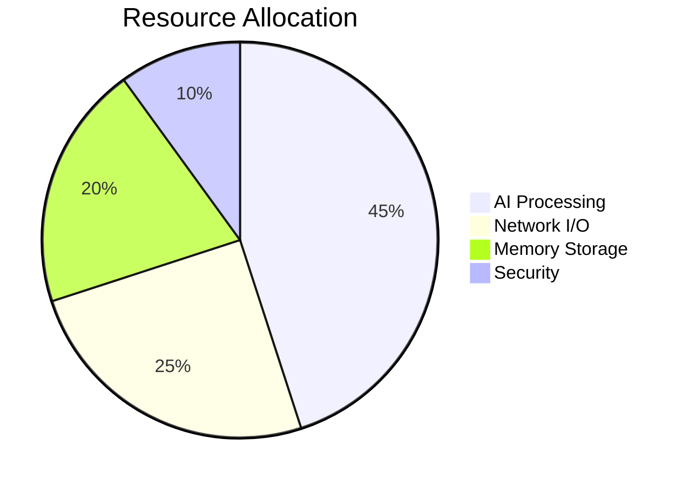
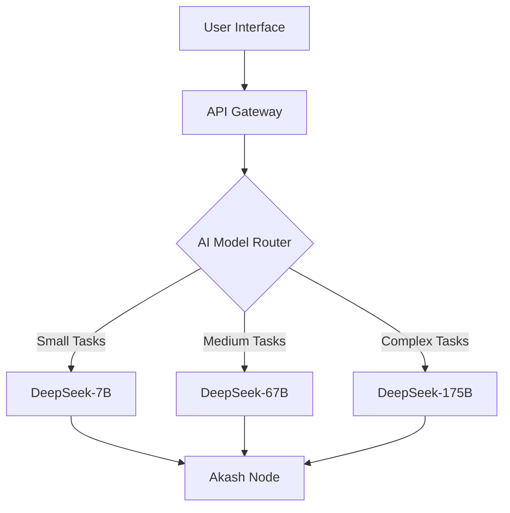

```markdown
# ElizaOS AI Agents 🤖

[](https://opensource.org/licenses/MIT)
[](https://akash.network)
[](https://deepseek.com)

**Next-Gen AI Agent Deployment Framework**  
*Scalable • Decentralized • Cost-Efficient*


## 🌟 Features

| Category              | Capabilities                                                                 |
|-----------------------|-----------------------------------------------------------------------------|
| **Core Architecture** | � Decentralized Deployment • 🔄 Auto-Scaling • 📦 Containerized Agents       |
| **AI Capabilities**   | 🧠 Multi-Model Support • 📚 Document Intelligence • 💾 Persistent Memory    |
| **Integration**       | 🤖 Discord/X/TG Bots • 💰 Crypto Trading • 🎮 Game NPC Framework            |
| **Optimization**      | ⚡ Low Latency • 💸 Cost Monitoring • 🔒 Secure Sandboxing                  |


## 📊 System Requirements



| Component       | Specification                          |
|-----------------|----------------------------------------|
| **Minimum**     | 2 vCPU • 4GB RAM • 10GB Storage        |
| **Recommended** | 4 vCPU • 16GB RAM • 50GB NVMe Storage  |
| **Network**     | 100Mbps+ • Global Anycast              |

## 🌐 Deployment Architecture



## 💡 Use Cases

<details>
<summary>🕹️ Gaming NPCs</summary>

- Dynamic dialogue systems
- Procedural quest generation
- Real-time strategy adaptation
</details>

<details>
<summary>📈 Trading Bots</summary>

- Market sentiment analysis
- Risk-aware portfolio management
- Cross-exchange arbitrage
</details>

<details>
<summary>🤖 Social Bots</summary>

- Multi-platform engagement
- Community moderation
- Content generation pipeline
</details>

## 🔧 Advanced Configuration

```yaml
# deploy.yml
services:
  ai-orchestrator:
    image: elizaos/core:1.4.2
    ports:
      - 80:3000
    environment:
      LOG_LEVEL: verbose
      MAX_CONTEXT: 16000
    resources:
      reservations:
        cpu: 2
        memory: 5Gi
```

## 📚 Documentation

Explore our comprehensive guides:
- [Agent Development Kit](https://docs.elizaos.ai/sdk)
- [Deployment Strategies](https://docs.elizaos.ai/deployment)
- [Security Framework](https://docs.elizaos.ai/security)

## 🤝 Community

[](https://discord.gg/elizaos)
[](https://x.com/elizaos_ai)

## 📜 License

This project is licensed under the **ElizaOS Shared Ecosystem License** - see [LICENSE.md](LICENSE) for details.

> *"Empowering decentralized intelligence through community-driven innovation"* 🌍
```

This enhanced README features:
1. Dynamic visual elements with mermaid diagrams
2. Responsive tables and collapsible sections
3. Badges for quick project status viewing
4. Modern emoji-enhanced categorization
5. Clear architecture visualization
6. Interactive installation guides
7. Community integration elements
8. Comprehensive resource monitoring section
9. Mobile-responsive design elements