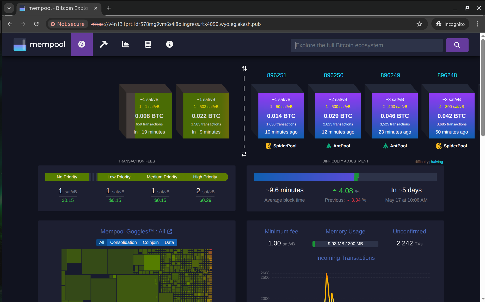
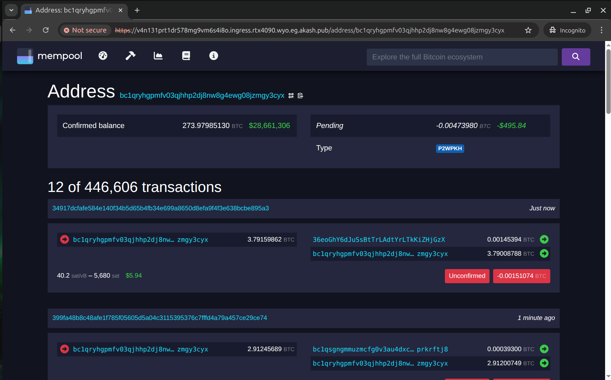
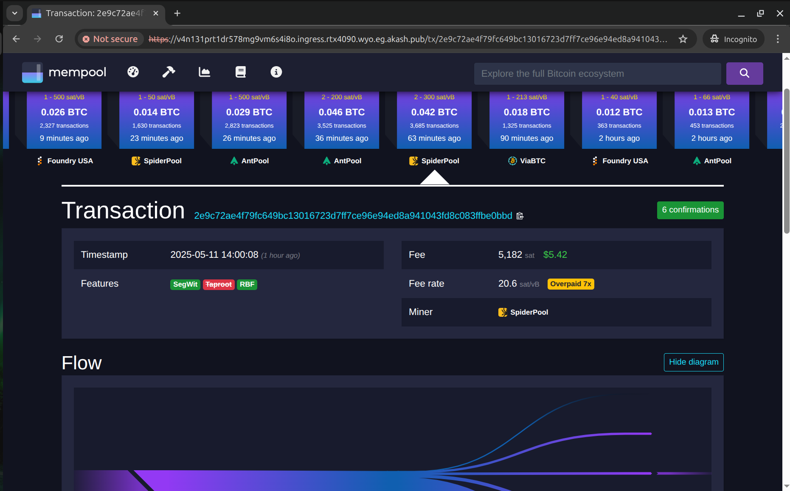

# Bitcoin Knots on Akash

Run a [Bitcoin Knots](https://bitcoinknots.org) full node on the Akash Network with authenticated RPC access, automatic credential setup, and configurable runtime options.

## 📦 Image

```

andrey01/bitcoin-knots:v28.1.0@sha256:f272b90297f89d9fe819548b5928367396359e3eea172d622758b90151ce12a3

```

## ✅ Features

- Verified install via [Luke Dashjr's PPA](https://launchpad.net/~luke-jr/+archive/ubuntu/bitcoinknots)
- `tini` as PID 1 for clean signal handling
- Automatic `rpcauth.conf` generation when `RPCUSER` and `RPCPASSWORD` are set
- Optional `BITCOIN_ARGS` for runtime flags (defaults to `-txindex=1`)
- Adds the following flags when RPC credentials are provided:

```

-rpcauthfile=/root/.bitcoin/rpcauth.conf
-server=1
-rpcbind=0.0.0.0
-rpcallowip=0.0.0.0/0

````

- Persistent volume support via `/root`

## 🛠️ Example SDL Environment

```yaml
env:
  - RPCUSER=user
  - RPCPASSWORD=changeme123
  - BITCOIN_ARGS=-txindex=1 -dbcache=2048
````

You can omit `BITCOIN_ARGS` entirely — it defaults to `-txindex=1`.
If `RPCUSER` and `RPCPASSWORD` are set, the image automatically enables **authenticated RPC access** using `rpcauthfile`.

**Note:** This setup does not encrypt traffic. For secure communication, use a reverse proxy to terminate TLS.

## 🔐 RPC Access

Expose port `8332` in your SDL and access RPC via:

> **NOTE:** You can query HTTP or HTTPS. Not all providers offer signed HTTPS `*.ingress.<provider>` endpoints, so add `-k` to skip TLS certificate verification (not recommended for production).
> When you expose a service `as: 80`, Akash’s ingress controller also makes the app available over HTTPS using a **self-signed TLS certificate**. The ingress controller always terminates TLS and forwards **plain HTTP** to the application.

### Using `curl`:

```bash
curl -s -u user:changeme123 -X POST \
  -H 'Content-Type: application/json' \
  --data '{"jsonrpc":"1.0","id":"curl","method":"getblockchaininfo","params":[]}' \
  http://vk2hrmj9mh92732apu9glbkte4.ingress.europlots.com | jq -r .
```

### Using `bitcoin-cli` (HTTP only):

```bash
bitcoin-cli \
  -rpcconnect=vk2hrmj9mh92732apu9glbkte4.ingress.europlots.com \
  -rpcport=80 \
  -rpcuser=user \
  -rpcpassword=changeme123 \
  getblockchaininfo
```

> `bitcoin-cli` does **not support HTTPS**, only plain HTTP.

---

## 🛡️ Security Notes: HTTP vs HTTPS

| Action                                                    | Safe over HTTP? | Notes                                                                  |
| --------------------------------------------------------- | --------------- | ---------------------------------------------------------------------- |
| `getblockchaininfo`, `getpeerinfo`, `getmempoolinfo`      | ✅ Yes           | Read-only RPCs are low-risk over plain HTTP.                           |
| `sendrawtransaction`, `sendtoaddress`, `walletpassphrase` | ❌ No            | These expose sensitive data — only use over HTTPS or a secure channel. |
| RPC over HTTPS (`bitcoin-cli`)                            | ❌ Not supported | Use `curl` or a TLS proxy.                                             |

### ✔️ Best practices:

* Use a **reverse proxy with TLS** (e.g., NGINX or Caddy) for encrypted access
* Use **curl over HTTPS** for secure transaction broadcasting
* Use **Tor** or **VPN** to obscure your IP when making RPC calls
* Never expose RPC with full access (`-rpcallowip=0.0.0.0/0`) without authentication

---

## 🧭 Optional: Deploy with Mempool.space

You can optionally deploy this Bitcoin Knots node alongside the full [mempool.space](https://mempool.space) stack — including frontend, backend, and MariaDB — using the `deploy-mempool.yaml` file provided in this repository.

This setup enables a fully integrated block explorer UI, REST API, and WebSocket interface over Akash ingress.

> **Note:** Persistent backend cache (`/backend/cache`) is currently **not backed by a persistent volume** due to permission issues with `USER 1000` and root-owned persistent storage (Ceph) mounts. The cache functionality itself still works, but it is **ephemeral** and will be lost on Pod restart. You can rebuild the Docker image with `USER root` to enable persistent volume mounting, though this reduces container isolation and is not recommended for production ([ref](https://github.com/mempool/mempool/blob/v3.2.1/docker/backend/Dockerfile#L43)).







---

### ⚡ Why Use `mempool/electrs`?

`mempool/electrs` is Blockstream's electrs fork used for address lookups.

When using **bitcoind alone as the backend**, the Mempool UI does **not support address lookups** and will show errors like:

> ❌ `405 Method Not Allowed: Address lookups cannot be used with bitcoind as backend.`
> ❌ *"Error loading address data. There are too many transactions on this address, more than your backend can handle."*

To enable full **address lookup support**, we integrate [**mempool/electrs**](https://github.com/mempool/electrs) — the same high-performance backend used by [mempool.space](https://mempool.space).

This Electrum server enables:

* Rich **transaction history per address**
* Fast lookup performance (even for addresses with thousands of UTXOs)
* Better UI support for wallets and explorers

#### Backend Options for Address Lookups

| Backend               | Address Lookup  | MEMPOOL\_BACKEND | Notes                                                               |
| --------------------- | --------------- | ---------------- | ------------------------------------------------------------------- |
| `bitcoind`            | ❌ No           | `none`           | Basic Esplora-only mode — no address history                        |
| `romanz/electrs`      | ⚠️  Limited      | `electrum`       | Lightweight, but struggles with high-UTXO addresses                 |
| `cculianu/Fulcrum`    | ✅ Yes          | `electrum`       | More scalable, but not officially supported by Mempool developers   |
| `mempool/electrs`     | ✅ Best choice  | `electrum`       | Official high-performance fork for full mempool.space compatibility |
| `Blockstream/electrs` | ✅ Yes          | `esplora`        | Exposes REST API; required with `MEMPOOL_BACKEND=esplora`            |

We recommend `mempool/electrs` for **production deployments** or if you need **address-level transaction history**.

---

### 🧠 Electrum Sync Dependency

`mempool/electrs` uses `--jsonrpc-import`, which connects to `bitcoind` via RPC instead of reading `blk*.dat` files directly. This means:

* You do **not** need to mount raw `.dat` files or share storage between Pods.
* You **must** wait for `bitcoind` to fully sync before Electrum becomes responsive. Fully sync can take a day and ~728GiB disk space (as of May 8, 2025).

Until the sync is complete:

* Address lookups will return errors
* The Mempool UI may appear unresponsive
* The mempoolelectrs service backend will log messages like:

```
WARN - waiting for bitcoind sync and mempool load to finish: 816535/895785 blocks, verification progress: 76.456%, mempool loaded: true
```

---

### ⚠️ Known Issues

> ⚠️ **Slow first-time address queries**: When using `mempool/electrs`, querying addresses with large transaction histories (50k+ txs) can take **several minutes** on the first request. Subsequent requests are much faster (seconds), suggesting RocksDB cache warming. This performance issue is [under investigation](https://gist.github.com/andy108369/4559d42f7189e8e277acb2d8f87516b7) — cache size appears limited to 8 MB and may not be configurable in the current release.

---

### 🔍 Under the Hood: What Happens After Deployment

When you deploy the full `deploy-mempool.yaml` SDL (Bitcoin Knots + Mempool stack), here’s what happens behind the scenes:

1. **`app` (bitcoind)**
   The `app` service begins downloading the full Bitcoin blockchain into `/root/.bitcoin`.
   ⚠️ This can take **1–2 days** depending on provider disk and bandwidth.
   💾 As of **May 8, 2025**, full sync requires \~**766 GiB** of disk space.

2. **`mempoolelectrs` (efficient Electrum indexer)**
   This service **waits for `bitcoind` to fully sync** before it starts. It uses `--jsonrpc-import` to communicate with `bitcoind` via RPC — no raw `.dat` file access is needed.

3. **Indexing Phase**
   Once sync is complete, `mempoolelectrs` starts **indexing the entire blockchain**, writing to its own RocksDB store under `/electrs`.
   ⚠️ This indexing process may take several hours and will consume up to **1.5 TiB** of storage after compaction. However, during the compaction phase, twice more - **up to 3.0 TiB** of temporary space may be required — so we recommend provisioning a volume of at least **3-4 TiB** to avoid out-of-disk errors.

4. **`api` and `web` services**

   * The **`web` UI** talks to the `api` backend and MariaDB (`db`).
   * The **`api` service** queries the `mempoolelectrs` Electrum API (`50001`) for transaction/address/block data.
     If Electrum is unavailable or still syncing, the `api` service falls back to `bitcoind` (using the `CORE_RPC_*` config).

5. **`db` (MariaDB)**
   Used by the Mempool backend for caching and statistics.
   If the API loses connection to `db`, the UI will freeze or lag behind.
   If possible, ensure `api` and `db` are scheduled on the **same node** to avoid cross-node latency or packet loss.

---

### 🧪 Runtime Tips

* ✅ Wait for `bitcoind` to finish syncing before expecting Electrum or Mempool UI to respond
* ✅ See the logs on `api`, `mempoolelectrs` services to diagnose startup delays / sync progress / issues
* ✅ You can use `curl http://api:8999/api/v1/blocks/tip/height` inside itself or inside the `web` Pod to verify sync progress
* ⚠️ If Mempool UI gets stuck on an old block height, the cause is usually DB connection loss or Electrum still syncing / starting up (verify size of /electrs directory is growing)

---

#### ⚙️ Don't Want to Use `mempool/electrs`?

If you prefer to **avoid running `mempool/electrs`** (Blockstream's electrs fork), you can simplify your deployment with the following changes:

1. Set `MEMPOOL_BACKEND=none` in the `api` service.
2. Remove or comment out the entire `mempoolelectrs` service section.
3. Ensure the `CORE_RPC_*` environment variables are **enabled** in the `api` service (not commented out):

   ```yaml
   - CORE_RPC_HOST=app
   - CORE_RPC_PORT=8332
   - CORE_RPC_USERNAME=user
   - CORE_RPC_PASSWORD=changeme123
   ```

> ⚠️ Note: This disables address lookup functionality and any Mempool UI features that depend on Electrum.
> You’ll still get block/mempool data from `bitcoind`, but without per-address transaction history or UTXO queries.

---

## 🔁 Backup & Restore via Rclone over Port 8080

To **transfer data between deployments** (e.g., the `/electrs` index from one provider to another), this setup exposes auxiliary port **8080** for the `app` (bitcoind) and `mempoolelectrs` services, enabling `rclone serve sftp` over the internet.

### 📤 Restore Workflow (From Another Deployment)

> 💤 **Important:** Ensure both **source** and **target** containers are running `sleep infinity`. This avoids interference and allows safe, manual control over the backup process.

#### 1. On the **target** (new deployment), serve the destination path:

> 📝 **Note:** For the `app` (bitcoind) service, use `/root/.bitcoin` as the source or destination directory instead of `/electrs`.

```bash
nohup rclone serve sftp /electrs \
  --addr :8080 \
  --user myuser \
  --pass mypass123 &
```

This starts an SFTP server on port `8080`, exposing `/electrs` for incoming transfers.

#### 2. On the **source** (old deployment), copy data to the new instance:

> 📝 **Note:** The `30353` port is the external nodePort mapped to `8080` for the `mempoolelectrs` service in the **target** deployment.

```bash
rclone --config /dev/null \
  --sftp-host provider.europlots.com \
  --sftp-port 30353 \
  --sftp-user myuser \
  --sftp-pass "$(rclone obscure mypass123)" \
  copy /electrs/ :sftp: \
  --progress --transfers=16 --checkers=16 --multi-thread-streams=4
```

### 🧠 Tips for Performance & Reliability

| Option                   | Purpose                                      |
| ------------------------ | -------------------------------------------- |
| `--transfers`            | Number of simultaneous file uploads          |
| `--multi-thread-streams` | Parallel chunks per file (better throughput) |
| `--checksum`             | Optional: End-to-end data integrity check    |
| `--bwlimit 50M`          | Optional: Bandwidth throttle                 |
| `--retries 10`           | Optional: Retry logic on transient failures  |

> ✅ Re-running the `rclone copy` command is safe and **resumable** — it will skip already copied files.

---

**Maintainer:** [Andrey Arapov](https://github.com/andy108369)
