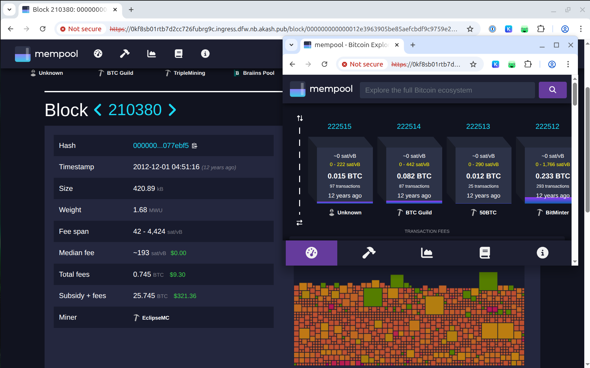

# Bitcoin Knots on Akash

Run a [Bitcoin Knots](https://bitcoinknots.org) full node on the Akash Network with authenticated RPC access, automatic credential setup, and configurable runtime options.

## 📦 Image

```

andrey01/bitcoin-knots:v28.1.0@sha256:f272b90297f89d9fe819548b5928367396359e3eea172d622758b90151ce12a3

```

## ✅ Features

- Verified install via [Luke Dashjr's PPA](https://launchpad.net/~luke-jr/+archive/ubuntu/bitcoinknots)
- `tini` as PID 1 for clean signal handling
- Automatic `rpcauth.conf` generation when `RPCUSER` and `RPCPASSWORD` are set
- Optional `BITCOIN_ARGS` for runtime flags (defaults to `-txindex=1`)
- Adds the following flags when RPC credentials are provided:

```

-rpcauthfile=/root/.bitcoin/rpcauth.conf
-server=1
-rpcbind=0.0.0.0
-rpcallowip=0.0.0.0/0

````

- Persistent volume support via `/root`

## 🛠️ Example SDL Environment

```yaml
env:
  - RPCUSER=user
  - RPCPASSWORD=changeme123
  - BITCOIN_ARGS=-txindex=1 -dbcache=2048
````

You can omit `BITCOIN_ARGS` entirely — it defaults to `-txindex=1`.
If `RPCUSER` and `RPCPASSWORD` are set, the image automatically enables **authenticated RPC access** using `rpcauthfile`.

**Note:** This setup does not encrypt traffic. For secure communication, use a reverse proxy to terminate TLS.

## 🔐 RPC Access

Expose port `8332` in your SDL and access RPC via:

> **NOTE:** You can query HTTP or HTTPS. Not all providers offer signed HTTPS `*.ingress.<provider>` endpoints, so add `-k` to skip TLS certificate verification (not recommended for production).
> When you expose a service `as: 80`, Akash’s ingress controller also makes the app available over HTTPS using a **self-signed TLS certificate**. The ingress controller always terminates TLS and forwards **plain HTTP** to the application.

### Using `curl`:

```bash
curl -s -u user:changeme123 -X POST \
  -H 'Content-Type: application/json' \
  --data '{"jsonrpc":"1.0","id":"curl","method":"getblockchaininfo","params":[]}' \
  http://vk2hrmj9mh92732apu9glbkte4.ingress.europlots.com | jq -r .
```

### Using `bitcoin-cli` (HTTP only):

```bash
bitcoin-cli \
  -rpcconnect=vk2hrmj9mh92732apu9glbkte4.ingress.europlots.com \
  -rpcport=80 \
  -rpcuser=user \
  -rpcpassword=changeme123 \
  getblockchaininfo
```

> `bitcoin-cli` does **not support HTTPS**, only plain HTTP.

---

## 🛡️ Security Notes: HTTP vs HTTPS

| Action                                                    | Safe over HTTP? | Notes                                                                  |
| --------------------------------------------------------- | --------------- | ---------------------------------------------------------------------- |
| `getblockchaininfo`, `getpeerinfo`, `getmempoolinfo`      | ✅ Yes           | Read-only RPCs are low-risk over plain HTTP.                           |
| `sendrawtransaction`, `sendtoaddress`, `walletpassphrase` | ❌ No            | These expose sensitive data — only use over HTTPS or a secure channel. |
| RPC over HTTPS (`bitcoin-cli`)                            | ❌ Not supported | Use `curl` or a TLS proxy.                                             |

### ✔️ Best practices:

* Use a **reverse proxy with TLS** (e.g., NGINX or Caddy) for encrypted access
* Use **curl over HTTPS** for secure transaction broadcasting
* Use **Tor** or **VPN** to obscure your IP when making RPC calls
* Never expose RPC with full access (`-rpcallowip=0.0.0.0/0`) without authentication

---

## 🧭 Optional: Deploy with Mempool.space

You can optionally deploy this Bitcoin Knots node alongside the full [mempool.space](https://mempool.space) stack — including frontend, backend, and MariaDB — using the `deploy-mempool.yaml` file provided in this repository.

This setup enables a fully integrated block explorer UI, REST API, and WebSocket interface over Akash ingress.

> **Note:** Persistent backend cache (`/backend/cache`) is currently **not backed by a persistent volume** due to permission issues with `USER 1000` and root-owned persistent storage (Ceph) mounts. The cache functionality itself still works, but it is **ephemeral** and will be lost on Pod restart. You can rebuild the Docker image with `USER root` to enable persistent volume mounting, though this reduces container isolation and is not recommended for production ([ref](https://github.com/mempool/mempool/blob/v3.2.1/docker/backend/Dockerfile#L43)).



---

**Maintainer:** [Andrey Arapov](https://github.com/andy108369)
