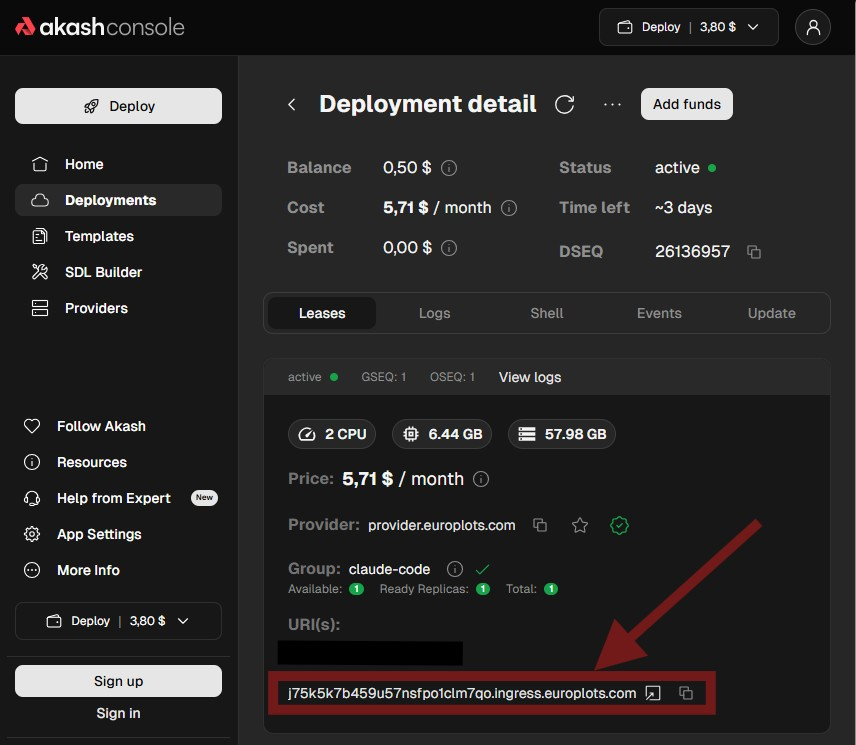
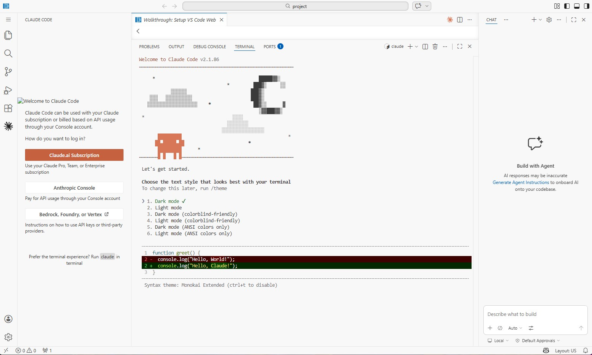

# Claude Code 

*A ready-to-use isolated environment with Cloud Code installed.*

Interaction via the **VS Code** web interface.

**We recommend using persistent storage for the `/root/.claude/` folder to avoid data loss when restarting the container.**

After deployment, follow the link in the **"Leases"** tab.

Enter the password you specified during deployment.

Use the terminal command `claude auth login` or log in via the pre-installed extension.

**Your Claude is ready to go!** 

**Enjoy!**
