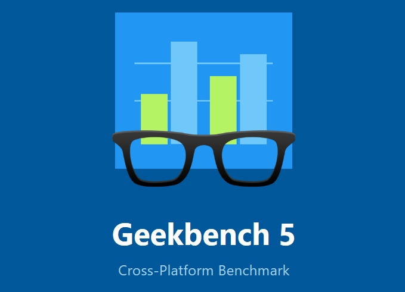

# Geekbench 5

A cross-platform benchmark that measures your system's performance with the press of a button. How will your mobile device or desktop computer perform when push comes to crunch? How will it compare to the newest devices on the market? Find out today with Geekbench 5.

# CPU Benchmark

Geekbench 5 measures your processor's single-core and multi-core power, for everything from checking your email to taking a picture to playing music, or all of it at once. Geekbench 5's CPU benchmark measures performance in new application areas including Augmented Reality and Machine Learning, so you'll know how close your system is to the cutting-edge.

# Compute Benchmark

Test your system's potential for gaming, image processing, or video editing with the Compute Benchmark. Test your GPU's power with support for the OpenCL, CUDA, and Metal APIs. New to Geekbench 5 is support for Vulkan, the next-generation cross-platform graphics and compute API.

# Cross-Platform

Compare apples and oranges. Or Apples and Samsungs. Designed from the ground-up for cross-platform comparisons, Geekbench 5 allows you to compare system performance across devices, operating systems, and processor architectures. Geekbench 5 supports Android, iOS, macOS, Windows, and Linux.

# Geekbench Browser

Upload your results to the Geekbench Browser to share them with others, or to let the world know how fast (or slow) your devices can go! You can track all your results in one place by creating an account, and find them easily from any of your devices.
