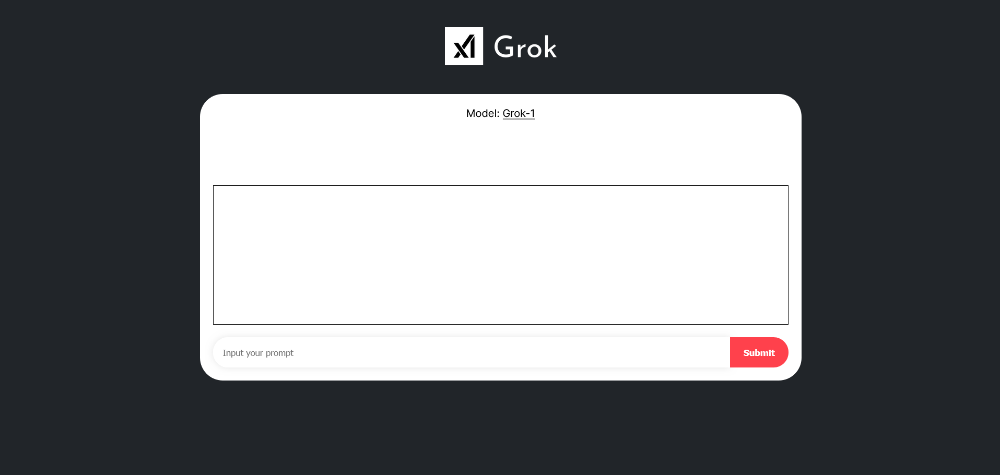

# Grok on Akash Network

Grok-1 is a 314 billion parameter Mixture-of-Experts model trained from scratch by xAI.

This deployment requires 8x H100 80GB or equivalent GPUs. With ~400 MB/s download speed, downloading grok model can take up to 25 minutes, while loading checkpoints can take up to 10 minutes.

## Steps

1. Deploy on [Akash Console](https://console.akash.network/new-deployment) using this [SDL.](deploy.yaml)
2. After deployed, look at the "Logs" tab and wait until the grok model downloaded and checkpoints loaded.
3. Go to "Leases" tab and click the deployment link.
4. Test your grok by entering your prompt and click "Submit".
