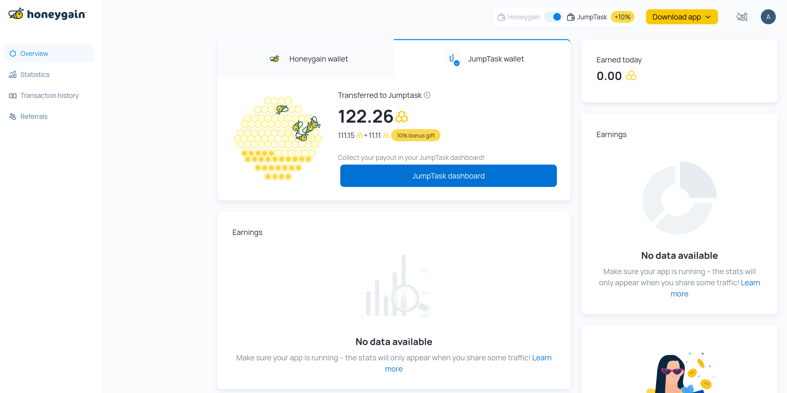

# Honeygain: Passive Income - Effortlessly

Honeygain is the first-ever app that allows its users to make money online by sharing their Internet connection.
With Honeygain, you can make money by simply sharing your Internet. Start earning now.

# How to?

1.  Sign up on https://dashboard.honeygain.com/
2.  Click Deploy and enter the email and pass used for Honeygain in `-email REPLACE_ME -pass REPLACE_ME -device akash`
3.  Deploy and choose an Akash provider.  Try not to repeat using the same provider or you may get an IP error.
4.  After a successful deployment check "My network" tab in the Honeygain dashboard.
5.  Share your referral code and recommend Akash to friends!

# Payment Rates : September 2022

1,000 Honeygain credits = $1
You get 3 credits for every 10MB shared.
$0.3/GB

# More info

Share Akash with the Honeygain community!
https://discord.com/invite/Qp8rFqqFqu
https://twitter.com/Honeygain_App

Honeygain Help Desk
https://support.honeygain.com/hc/en-us
