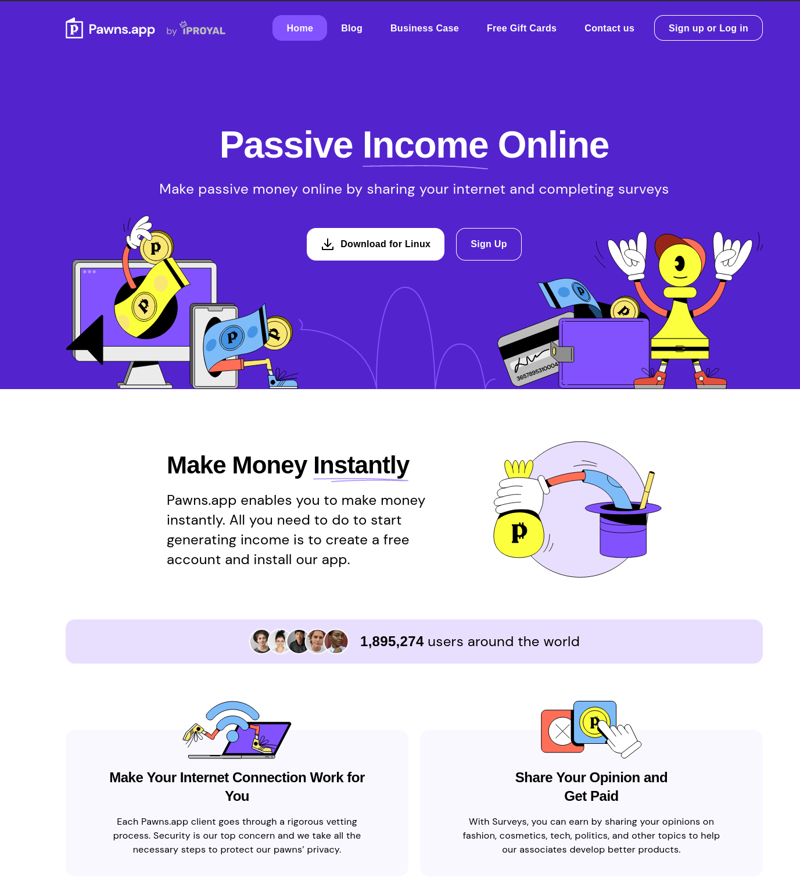

# Passive Income Online

Pawns.app enables you to make money instantly. All you need to do to start generating income is to create a free account and install our app.



# How to?

1.  Sign up on https://dashboard.pawns.app/register
2.  Click Deploy and change all the `REPLACE_ME` values with your Pawns account info.

```
- "-email"
- "REPLACE_ME"
- "-password"
- "REPLACE_ME"
```

3.  Deploy and choose an Akash provider.  Try not to repeat using the same provider or you may get an IP error.
4.  After a successful deployment check Pawns app dashboard to verify the connection.
5.  Share your referral code and recommend Akash to friends!


# Limitations

You will get an error if you try to deploy on a provider that does not have a residential IP address.  Try another provider and check the attributes for any IP information.


iproyal: {"happened_at":"2022-09-13T22:57:43Z","name":"not_running","parameters":{"error":"non_residential_ip","message":"ip is non residential"}}


# Payment Rates : September 2022

Right now we pay 0.20 USD per 1GB shared.


# A Few More Things That Impact Your Earnings

Location of your IP address

Right now, certain locations are more in demand than others, so some location will be more profitable. However, we accept everyone who wants to share their internet.
Unique IP addresses

You will also earn more if you run our application on more than one unique residential IP address. In other words, the more unique IPs you can use, the more you will earn.
Your internet speed

It’s essential for our clients to have a good ping from the Pawns.app network. The faster your internet connection is, you’ll be able to share and earn more.


# Pawns.app Is Built on Three Core Pillars

Security

We ask all our clients to identify themselves, so we know who uses your traffic at all times.
Safety

We never share any information about our pawns with any third parties.
Privacy

It’s essential for our clients to have a good ping from the IPRoyal network. The faster your internet connection is, you’ll be able to share and earn more.
Level Up

Join the Pawns.app Discord for news and updates on everything Pawns.app, and meet the community.


# More info

https://pawns.app/
