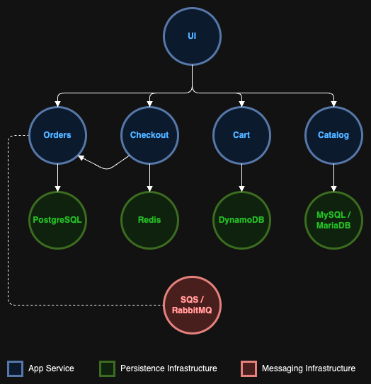

# Akash Microservices Example: Retail Store Application

This repository demonstrates how to deploy a complete microservices-based retail store application on the Akash Network. The application is based on the [AWS Containers Retail Store Sample App](https://github.com/aws-containers/retail-store-sample-app), showcasing best practices for containerized microservices deployment in a decentralized cloud environment.

## Application Architecture

The application has been deliberately over-engineered to generate multiple de-coupled components. These components generally have different infrastructure dependencies, and may support multiple "backends" (example: Carts service supports MongoDB or DynamoDB).

## Architecture Overview

This microservices architecture consists of 10 interconnected services that work together to provide a fully functional e-commerce platform. The services are organized into frontend, backend, database, and messaging components.

### Component Details

| Component | Language | Description |
|---------|---------|-------------|
| UI | Java | Store user interface |
| Catalog | Go | Product catalog API |
| Cart | Java | User shopping carts API |
| Orders | Java | User orders API |
| Checkout | Node | API to orchestrate the checkout process |

### Service Components

**Frontend:**
- `ui`: The user interface service that serves the web application to clients. It's exposed globally on port 8080 and communicates with all backend services.

**Shopping Cart Service:**
- `carts`: Manages shopping cart functionality with DynamoDB for persistence
- `carts-db`: Local DynamoDB instance for cart data storage

**Product Catalog Service:**
- `catalog`: Provides product catalog functionality with MySQL for persistence
- `catalog-db`: MariaDB database for catalog data storage

**Order Processing Service:**
- `orders`: Handles order processing with PostgreSQL for persistence
- `orders-db`: PostgreSQL database for order data storage
- `rabbitmq`: Message broker for asynchronous order processing

**Checkout Service:**
- `checkout`: Manages the checkout process with Redis for session storage
- `checkout-redis`: Redis instance for checkout session data

## Service Communication

The services communicate through a well-defined API architecture:
- The UI service connects to all backend services (carts, catalog, orders, checkout)
- The checkout service connects to the orders service for order creation
- Each service connects to its dedicated database service
- The orders service uses RabbitMQ for asynchronous message processing

## Deployment Configuration

This deployment is configured for the Akash Network with the following specifications:

- **Version**: 2.0 (Akash deployment format)
- **Resource Allocation**: Each service is allocated appropriate CPU, memory, and storage resources
- **Network Exposure**: 
  - Internal services are exposed only to dependent services
  - The UI service is exposed globally to allow external access
- **Pricing**: Configured for the dcloud placement with pricing in uakt (Akash tokens)

## Getting Started

To deploy this microservices application on Akash:

1. Ensure you have the Akash CLI installed and configured
2. Deploy using the provided `deploy.yaml` file
3. Access the application through the provisioned endpoint

## Best Practices Demonstrated

This example showcases several best practices for microservices deployment on Akash:

### SDL (Service Definition Language) and Technology Stack
- Built using Akash SDL (Service Definition Language) version 2.0
- Each service is defined with precise resource requirements (CPU, memory, storage)
- Containerized microservices using Docker images from the AWS Containers repository
- Multi-language architecture with Java, Go, and Node.js services
- Environment variables for service configuration and endpoint discovery

### Networking Architecture
- Service isolation through internal/external exposure configuration
- Internal services are exposed only to specific dependent services using service-to-service networking
- The UI service is exposed globally to allow external access
- Service discovery through DNS-based service names (e.g., http://carts:8080)
- Port mapping with external port 8080 mapped to internal port 8080 for all services
- Secure service-to-service communication within the deployment

### Security Practices
- Environment variables for sensitive configuration (database passwords, API keys)
- Service isolation to minimize attack surface
- Dedicated databases for each service to prevent data leakage
- No persistent storage exposed externally
- Resource limits to prevent resource exhaustion
- Network policies that restrict service communication to only what's necessary
- Decentralized deployment on Akash Network for improved resilience

### Deployment Configuration
- Resource allocation optimized for each service's needs
- Appropriate storage sizing with 1Gi for most services and 2Gi for orders-db
- CPU and memory allocation based on service requirements
- Pricing configuration for the dcloud placement in uakt (Akash tokens)
- Single replica for each service (count: 1) for this example deployment

## Acknowledgments

Special thanks to the [AWS Containers team](https://github.com/aws-containers/retail-store-sample-app) for creating the original retail store sample application that this deployment is based on. This example demonstrates how enterprise-grade microservices architectures can be adapted for decentralized cloud deployment on Akash.

