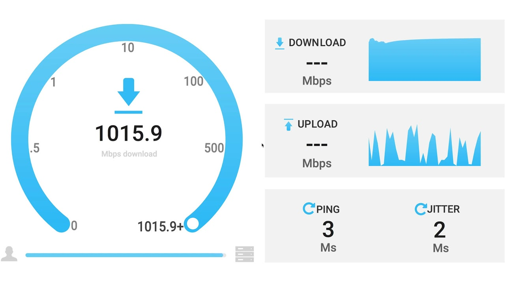

# OpenSpeedTest

Test connection speed to a provider. Lightweight and High Performance, OpenSpeedTest contains Only "STATIC" Files like HTML,CSS & JS. So you don't need to worry about Security Updates or Hidden Exploits that may compromise your secure environments.

OpenSpeedTest is written in Pure JavaScript. No Third-Party frameworks or libraries were used. SpeedTest script file size is under 7kB gzip. The unexpected side effect of using Pure JavaScript is High Performance.

# Run a speed test from Any Device.

OpenSpeedTest will run on Any Web Browser that is IE10 or new.

# Ready for Any Display Size and Resolution.

OpenSpeedTest User interface is written in SVG.
