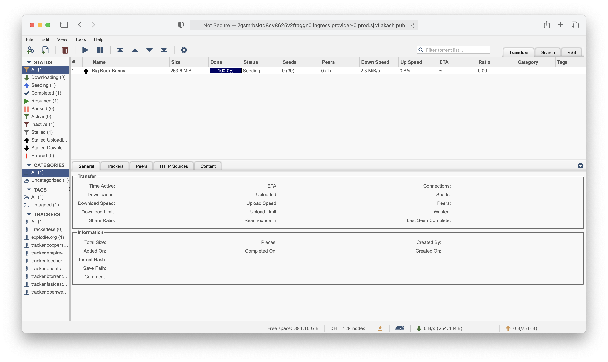
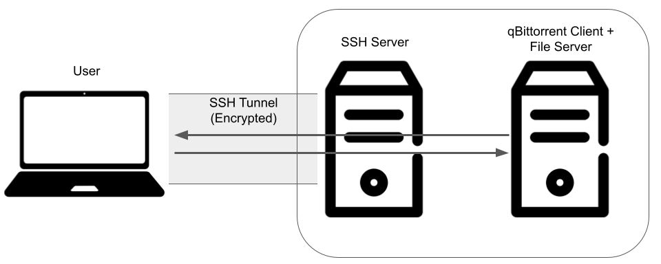

# qBittorrent

The [qBittorrent](https://www.qbittorrent.org/) project aims to provide an open-source software alternative to µTorrent. The provided deployment configuration ([`deploy-ssh-tunnel.yaml`](deploy-ssh-tunnel.yaml)) enables a relatively secure means of torrenting on Akash via qBittorrent. Please use this responsibly.



# Overview

The deployment uses a custom image (`ghcr.io/spacepotahto/qbittorrent:1.0.0`, code [here](https://github.com/spacepotahto/docker-qbittorrent-server)) that bundles the qBittorrent client ([base image](https://github.com/linuxserver/docker-qbittorrent) provided by LinuxServer.io) with a HTTP file server. This allows the user to access the qBitorrent WebUI to download files to the Akash provider, and to download the downloaded files through the HTTP file server. `deploy.yaml` and `deploy-ssh-tunnel.yaml` (recommended) differs in how security is handled.

# `deploy.yaml`

This configuration deploys the qBittorrent client + File Server, and the user can access them using their web browser. However, by default the Akash deployment is accessible through HTTP only, so traffic between the user and the qBittorrent WebUI + file server is unencrypted. Thus, it's recommended to enabled HTTPS. One way to do so is to use a custom domain with CloudFlare SSL as described in this [guide](https://teeyeeyang.medium.com/how-to-use-a-custom-domain-with-your-akash-deployment-5916585734a2) written by a community member. The downside is the traffic goes through CloudFlare. For personal use, using [`deploy-ssh-tunnel.yaml`](deploy-ssh-tunnel.yaml) instead is recommended.

## Usage
Once deployed, the qBittorrent WebUI is accessible at `http://<HOSTED URI>`. The default username and password is `admin` and `adminadmin` respectively. They can be changed via the WebUI settings once authenticated.

When downloading files using the WebUI, keep the default download location at `/downloads`. Once the files finish downloading, you can download the files to your computer by accessing the HTTP file server that serves `/downloads` at `http://<HOSTED URI>:<THE FORWARDED EXTERNAL PORT OF 5000>`.

# `deploy-ssh-tunnel.yaml` (Recommended)

Since this is likely for personal use only, it's also possible to utilize a SSH tunnel in lieu of HTTPS to establish an encyrpted connection between the user and qBittorrent WebUI + file server. The diagram below illustrates how this works:




The qBittorrent WebUI + file server deployment is not exposed to the public internet, and is only accessible from the SSH enabled deployment. The SSH enabled deployment is only accessible by the user through an encrypted connection. Thus the user can securely access the qBittorrent WebUI + file server through SSH tunneling.

## Usage
The [`deploy-ssh-tunnel.yaml`](deploy-ssh-tunnel.yaml) is configured to enable SSH tunneling (using the `ghcr.io/spacepotahto/openssh-server:1.0.0` image, code [here](https://github.com/spacepotahto/docker-openssh-server)), with the option to use password based or key based (generally safer) authentication through setting environment variables. Once deployed, you can establish the SSH tunnel with:

```
ssh -p <THE FORWARDED EXTERNAL PORT OF 2222> -N -L 8080:web:8080 -L 5000:web:5000 <USER_NAME>@<PROVIDER HOST>
```

Then in your browser, you can navigate to `http://localhost:8080` to access the qBittorrent WebUI. The default username and password is `admin` and `adminadmin` respectively. They can be changed via the WebUI settings once authenticated.

When adding the torrent files or magnet links using the WebUI, keep the default download location at `/downloads`. Once the files finish downloading, you can download the files to your computer by accessing the HTTP file server that serves `/downloads` at `http://localhost:5000`. Due to the SSH tunneling, your file download is done through an encrypted connection.