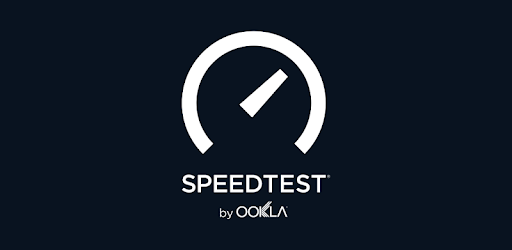

# Speedtest by Ookla

The definitive way to test the speed and performance of your internet connection. Every day, over ten million unique tests are actively initiated by our users in the locations and at the times when their connectivity matters to them. Since our founding in 2006, an unparalleled total of more than 40 billion tests have been taken with Speedtest.

Our commitment to providing transparency into the performance of networks is what drives us. Whether helping our users assess the speed of their individual connections through the Speedtest application or publishing analysis on the state of global markets and related trends, our team is always working to provide data that will help make the internet better and faster for everyone.
