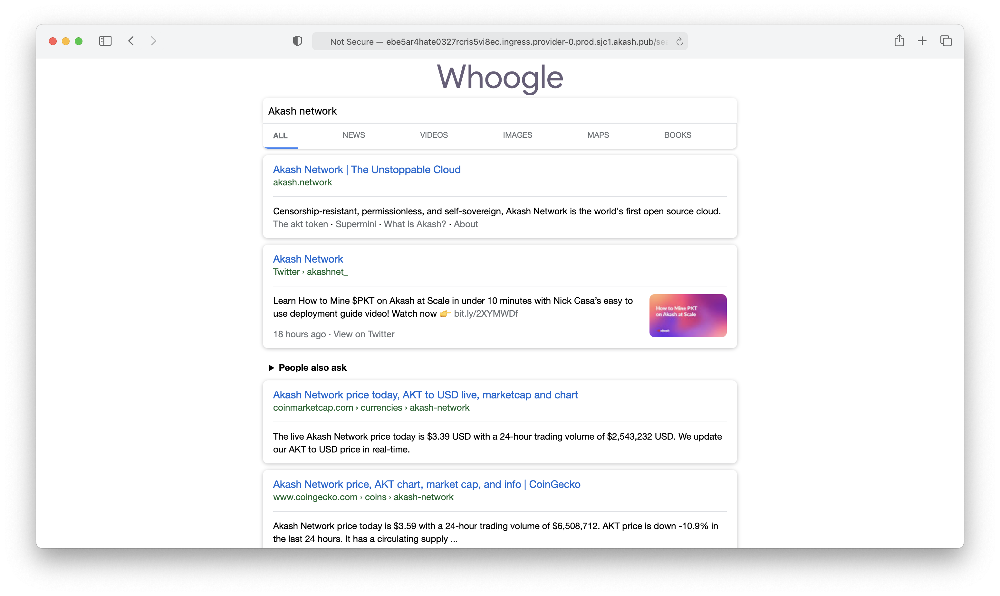

# Whoogle Search

Whoogle Search is a self-hosted, ad-free/AMP-free/tracking-free, privacy respecting alternative to Google Search. It works by sitting between the user and Google, and filtering whatever Google returns back, to remove things like ads/sponsored content, cookies, JavaScript, tags on urls related to ad campaigns and site referrals, etc. Since all queries are forwarded through the Akash provider, the query made to Google only contains the IP address and information of the provider rather than the user's. And because it's easy to redeploy to a different provider on Akash, users can rotate providers once in a while to further obfuscate. To learn more about the project, see the original project page on [Github](https://github.com/benbusby/whoogle-search) and this [reddit post](https://www.reddit.com/r/selfhosted/comments/ggronz/whoogle_search_a_selfhosted/) from the author.



## Deployment Configuration
The provided [`deploy.yaml`](deploy.yaml) (and [`deploy-ssh-tunnel.yaml`](deploy-ssh-tunnel.yaml)) is a sample SDL configuration that directly uses the official [benbusby/whoogle-search](https://hub.docker.com/r/benbusby/whoogle-search) DockerHub image. As such, the enviornment variables that the original image supports can also be specified in the SDL; the provided one shows how one can enable basic HTTP authentication by specifying the `WHOOGLE_USER` and `WHOOGLE_PASS` variables. Consult the project's [Github](https://github.com/benbusby/whoogle-search) for the full list of supported environment variables.

## `deploy-ssh-tunnel.yaml`?
By default, the Akash deployment is accessible through HTTP only, so traffic between the user and the hosted Whoogle is unencrypted. Thus, it's recommended to enabled HTTPS. One way to do so is to use a custom domain with CloudFlare SSL as described in this [guide](https://teeyeeyang.medium.com/how-to-use-a-custom-domain-with-your-akash-deployment-5916585734a2) written by a community member.

However, if this is for personal use only, it's also possible to utilize a SSH tunnel in lieu of HTTPS to establish an encyrpted connection between the user and the hosted Whoogle. The [`deploy-ssh-tunnel.yaml`](deploy-ssh-tunnel.yaml) is configured to enable SSH tunneling, with the option to use password based or key based (generally safer) authentication through setting environment variables. Once deployed, you can establish the SSH tunnel with:

```
ssh -p <THE FORWARDED EXTERNAL PORT OF 2222> -N -L 5000:web:5000 <USER_NAME>@<PROVIDER HOST>
```

And visit Whoogle by going to `http://localhost:5000` in your browser!